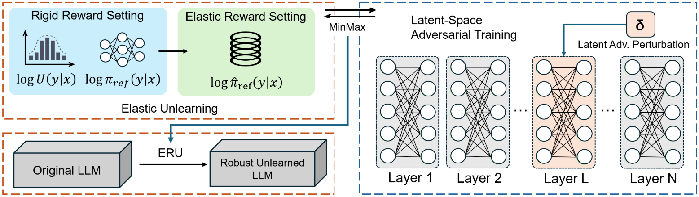

# Elastic Robust Unlearning of Specific Knowledge in Large Language Models

This is the code repository for the paper ***Elastic Robust Unlearning of Specific Knowledge in Large Language Models*.**



## Abstract

LLM unlearning aims to remove sensitive or harmful information within the model, thus reducing the potential risk of generating unexpected information. However, existing Preference Optimization (PO)-based unlearning methods suffer two limitations. First, their rigid reward setting limits the effect of unlearning. Second, the lack of robustness causes unlearned information to reappear. To remedy these two weaknesses, we present a novel LLM unlearning optimization framework, namely Elastic Robust Unlearning (ERU), to efficiently and robustly remove specific knowledge from LLMs. We design an elastic reward setting instead of the rigid reward setting to enhance the unlearning effect. Meanwhile, we propose latent-space adversarial training into the unlearning process to trigger specific failure patterns for enhancing the robustness of the unlearned model in multiple scenarios. Experimental results show that ERU can improve the unlearning effectiveness significantly while maintaining a high utility performance. Especially, in the WMDP-Bio benchmark, ERU shows a 11.1% improvement over the second-best method, and maintains 83% performance even under 1,000 sample fine-tuned retraining attacks, significantly better than the baseline method.

## Install Requirements

First, create a Python virtual environment.

```
conda create -n ERU python=3.10 && conda activate ERU
```

Prepare the enviroment.

~~~
pip install -r requirements.txt
~~~

## Training Time

Example of the training time for ERU under the TOFU with a 5% forget size, stating that it takes about **4 hours** in the computational environment described in the paper.

```
[2024-12-22 14:33:08] INFO: Task initialization started.
[2024-12-22 14:33:09] INFO: Unlearning task ID: UNL-2024-12-22-001
[2024-12-22 14:33:09] INFO: Target model: LLaMA-2-chat 7B 
[2024-12-22 14:33:10] INFO: Target data to unlearn: "User-specific data related to sensitive information"
[2024-12-22 14:33:11] INFO: Loading model weights from checkpoint: /models/LLaMA-2/weights/
[2024-12-22 14:33:20] INFO: Model loaded successfully.
[2024-12-22 14:33:21] INFO: Unlearning method: "Targeted Data Removal"
[2024-12-22 14:33:22] INFO: Starting data preprocessing for unlearning.
[2024-12-22 14:35:17] INFO: Starting unlearning process.
[2024-12-22 14:35:18] INFO: Learning rate adjusted from 1e-4 to 5e-5.
[2024-12-22 15:22:41] INFO: Unlearning iteration 1/5 completed. 
[2024-12-22 16:33:20] INFO: Unlearning iteration 2/5 completed. 
[2024-12-22 17:14:28] INFO: Unlearning iteration 3/5 completed. 
[2024-12-22 17:58:52] INFO: Unlearning iteration 4/5 completed. 
[2024-12-22 18:36:00] INFO: Unlearning iteration 5/5 completed. 
[2024-12-22 18:36:05] INFO: Unlearning process completed. 
[2024-12-22 18:36:07] INFO: Saving updated model weights to checkpoint: /models/LLM-3.5/weights/unlearned/
[2024-12-22 18:36:21] INFO: Model weights saved successfully.
[2024-12-22 18:36:23] INFO: Generating unlearning report.
[2024-12-22 18:36:25] INFO: Report generated. Summary:
    - Task ID: UNL-2024-12-22-001
    - Target Data: "User-specific data related to sensitive information"
    - Method: "Targeted Data Removal"
    - Iterations: 5
[2024-12-22 14:37:15] INFO: Task completed successfully.
[2024-12-22 14:37:15] INFO: Total execution time:  243 minutes 17 seconds.
```

